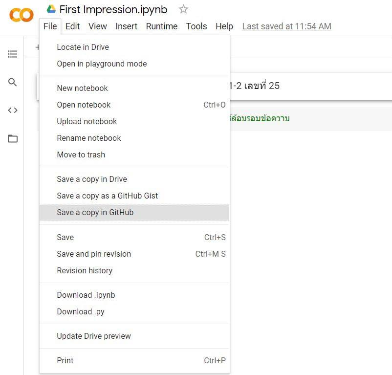
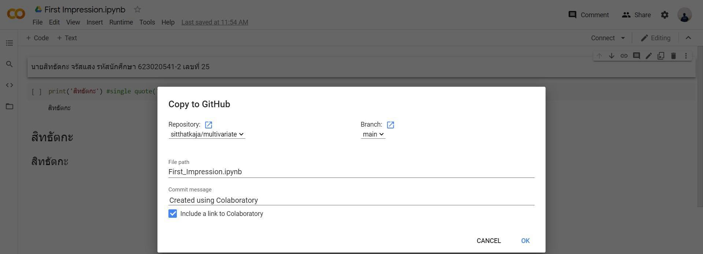

# multivariate

***

### :point_right: ชื่อ-สกุล : สิทธัตกะ จรัสแสง 
### :point_right: รหัสนักศึกษา : 623020541-2

***

##### :beginner: นามสกุล .md => makedown [สามารถดู Code ต่างๆได้ที่โดยคลิ้กที่นี้](https://github.com/adam-p/markdown-here/wiki/Markdown-Cheatsheet)

***

##### :book: ชื่อตัวแปร

[ ] => square brackets 

( ) => parentheses

***

##### :heavy_check_mark: ตัวอย่างการ Upload Image => add file >>> upload file >>> choose file >>> Finish

##### :heavy_check_mark: ตัวอย่างการใส่ภาพ !.[ คำอธิบายรูปภาพ ].( ไฟล์รูป.png ).

***

#### :exclamation: :exclamation: :exclamation: งานที่ได้รับหมอบหมาย :exclamation: :exclamation: :exclamation:

##### อธิบายการใช้งาน Github และ Google Colab ว่าหน้าที่แต่ละอันคืออะไร และอธิบายวิธีเซฟไฟล์จาก Google Colab ลงใน GitHub

| ชื่อ | การใช้งาน |
| ----------- | ----------- |
| Github | แหล่งรวมข้อความ Text รวมถึง Code ต่างๆสามารถแก้ไขได้โดย user และสามารถให้ user อื่นๆสามารถเข้ามาดูได้ |
| Google Colab | หน้าต่างสำหรับการเขียน Text และ Code ซึ่งตัว Code สามารถ Run ได้และ Text ใช้ Makedown ได้ อีกทั้งสามารถแชร์ลงใน Github ได้ |

##### วิธีการเซฟไฟล์จาก Google Colab ลงใน Github

* ใน Google Colab ให้ไปที่ File 

* เลือก Save a copy Github 

* เลือก Repository ที่จะถูกส่งไป

* เปลี่ยนชื่อ Commit message

* กด ok

* จากนั้นจะเข้าไปสู่หน้าเว็ปของ github ที่แสดงตัวของ Colab ที่ Saveไว้ให้ดูและถือว่าเป็นอันเสร็จสิ้น

***
